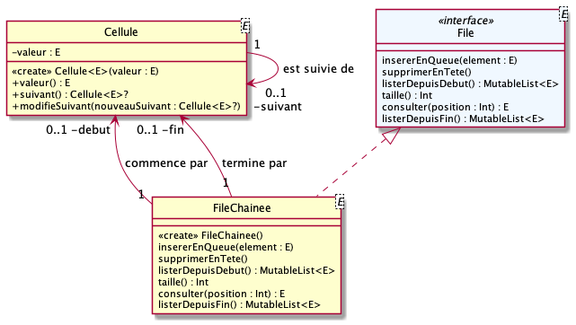
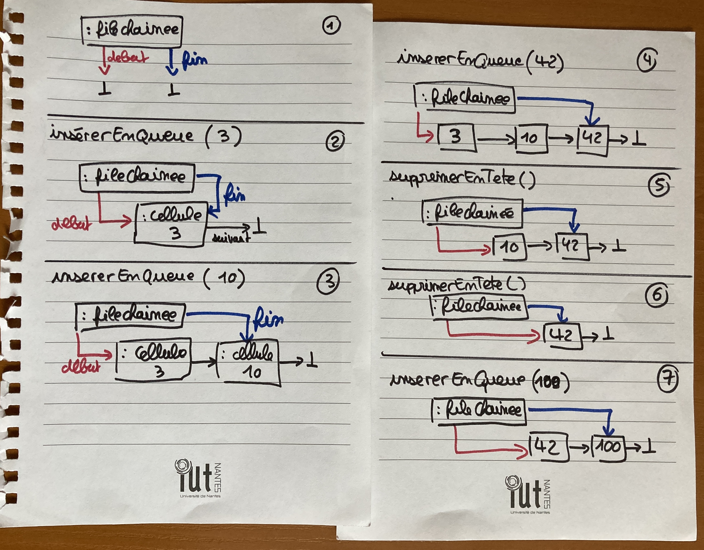

# qdev.dp.tp1

## Si nécessaire

proxy : `srv-proxy-etu-2.iut-nantes.univ-nantes.prive:3128`

SDK 14 : `/var/run/host/lib/jvm/jdk-14.0.2`

## Tests Junit
Des fichiers de tests Junit vous sont fournis : utilisez les pour valider votre code

## Travail à réaliser

### question 1

__NB : cet exercice faisait partie du dernier test machine de _but1.dev.objets___

Implémentez une file chainée `FileChainee<E>` comme décrite
par le diagramme de classes suivant :

L'interface `File<E>` documente toutes les méthodes à implémenter.

Le fonctionnement attendu de la file chainée est illustré par les schémas suivants :

### question 2

Proposez dans `FileArrayList<E>` une autre implémentation de l'interface `File<E>`; 
basée cette fois sur une collection de type `ArrayList<E>`.

