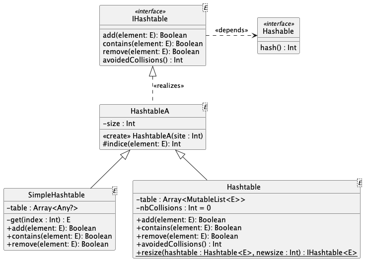

# qdev.dp.tp4 > Tables de hachage

## Introduction aux tables de hachage

### Généralités 

Les tables de hachage sont des structures de données de type _tableau associatif_.
L'objectif est de pouvoir vérifier très efficacement si un élément est déjà présent ou non.

    Les tables de hachage sont utilisées par les collections 
    HashSet<T> et HashMap<K,E> de Kotlin

Pour cela, l'indice où stockée un élément est donnée par 
une fonction de hachage modulo la taille de la table de hachage.

NB : une fonction de hachage transforme un élément quelconque en un nombre (=une position)

### 1er exemple 

Considérez les personnes (nom, age, ville) suivantes : 
* P1=("Alfred", 42, "Nantes")
* P2=("Justine", 20, "Rennes") 
* P3=("Kevin", 9, "Paris")

Considérez la table de hachage suivante (taille = 5) :

| indice | 0   | 1   | 2   | 3   | 4   |
|--------|-----|-----|-----|-----|-----|
| valeur | []  | []  | []  | []  | []  |

Considérez la fonction de hachage suivante 

    hachage(p : Pers) = p.age

Remplir la table avec les personnes donnent alors :

| indice | 0   | 1   | 2   | 3   | 4   |
|--------|-----|-----|-----|-----|-----|
| valeur | P2  | []  | P1  | []  | P3  |

puisque
* hachage(P1) = 42 ; 42 % 5 = 2
* hachage(P2) = 20 ; 20 % 5 = 0
* hachage(P3) = 9 ; 9 % 5 = 4

Pour rechercher si une personne XX est dans la table,
il suffit de
* calculer l'indice de hachage de XX
* regarder s'il y a quelque chose dans la table à l'indice considéré
* regarder si ce quelque chose est égal à XX

### 2nd exemple

Considérez maintenant la fonction de hachage suivante 

    hachage(p : Pers) = p.nom[0].toInt()

Remplir la table donne maintenant :

| indice | 0   | 1   | 2   | 3   | 4   |
|:-------|-----|-----|-----|-----|-----|
| valeur | P1  | []  | []  | []  | P2  |

mais que faire de P3 ?

* hachage(P1) = 65 ; 65 % 5 = 0
* hachage(P2) = 74 ; 74 % 5 = 4
* hachage(P3) = 75 ; 75 % 5 = 0 : **PROBLEME**, la fonction de hachage % taille donne la même position pour deux éléments ?

    On dit qu'il y a une COLLISION

Changer la taille de la table et/ou la fonction de hachage ne permet 
pas de régler le problème des collisions

### Table de hachage et collisions

Pour éviter les collisions, il faut utiliser une structure plus complexe
qu'un simple tableau associatif : une des solutions consiste
à réaliser un _chaînage externe_, c-à-d utiliser un 
tableau de listes : 
* L'indice du tableau correspondra toujours à la fonction de hachage modulo la taille du tableau.
* au lieu de stocker un élément, on stockera à l'indice donné, tous les éléments ayant le même hachage, dans une liste.

Dans l'exemple précédent cela donnerait : 

| indice | liste de valeurs |
|--------|------------------|
| 0      | P3 -> P1 -> []   |
| 1      | []               |
| 2      | []               |
| 3      | []               |
| 4      | P2 -> []         |

Pour rechercher si XX est dans la table,
il suffit de
* calculer l'indice de hachage de XX
* regarder si la liste à l'indice considéré est viee ou non ?
* regarder si la liste contient XX

https://fr.wikipedia.org/wiki/Table_de_hachage

## Travail à faire

L'interface `IHashtable` donne les fonctionnalités attendues par 
une table de hachage.

Les éléments qui pourront être stockés dans une table de hachage 
devront être `Hashable`, c-à-d proposé une méthode `hash(): Int`

La classe abstraite `HashtableA` définit pour toutes les tables de hachage
un constructeur permettant d'initialiser une taille.
Elle propose également une méthode `indice(element: E): Int`
qui donne l'indice d'un élément dans la table, c-à-d le hachage modulo la taille.

### Préliminaire

En observant le diagramme de classes, et le code fourni, 
déterminez quel(s) _design pattern_(s) sera(-ont) mis en oeuvre ?

### Implémenter `SimpleHashtable`

La classe `SimpleHashtable` est une table
de hachage sans gestion des collisions. L'arrivée d'une collision provoquera 
la levée d'une exception.

La structure de données interne proposée peut sembler complexe :

    table : Array<Any?>

Il s'agit d'un tableau de n'importe quoi, donc des éléments
de type `E`.

Ce tableau est initialisé à `null`

    table = arrayOfNulls<Any?>(size)

Une méthode réalise la conversion de `Any` vers `E` 
quand l'élément n'est pas `null`

Des cas de tests vous permettent de valider vos développements.

### Implémenter `Hashtable`

La classe `Hashtable` est une table
de hachage gérant les collisions par chaînage externe. 
L'arrivée d'une collision ne lève donc plus d'exception.

La structure de données interne proposée ici correspond bien à l'attendu :

    table : Array< MutableList<E> >

L'initialisation permet de remplir la table avec autant de
listes vides que nécessaire.

Des cas de tests vous permettent de valider vos développements.

### Mesurer l'intéret d'une table de hachage

Afin de (finir de) vous convaincre de l'intéret d'une table de hachage, 
comparé à une liste,
nous allons mesurer le temps mis pour rechercher l'absence 
d'un mot dans les deux structures

Dans `data/` vous avez plusieurs listes de mots, une de 100 mots, une de +13000 mots.

Ecrivez un programme principal qui 
1. Instancie `Hashtable<>`
2. Instancie une `MutableList<>`
3. lit l'un des fichiers dans `data/`
4. ajoute les mots lus dans la `Hashtable<>` et dans la `MutableList<>`
5. Mesure le temps mis pour rechercher `XXXXXXX` dans la `Hashtable<>`
6. Mesure le temps mis pour rechercher `XXXXXXX` dans la `MutableList<>`
