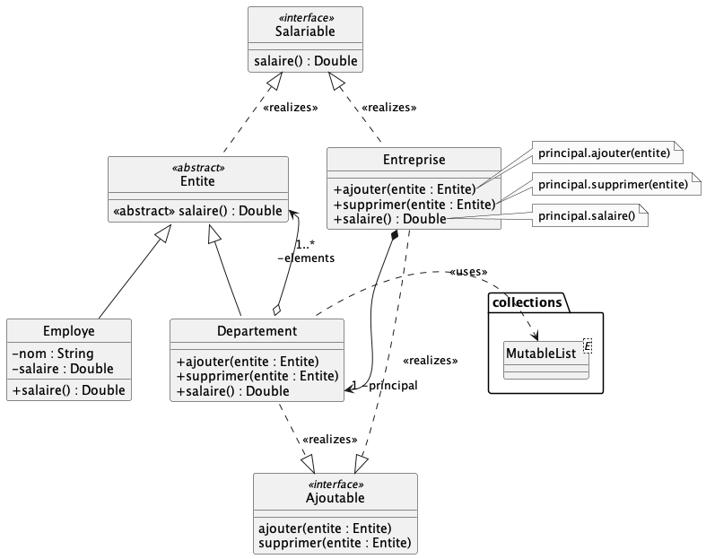

# TP n°6 : Design patterns

## Design pattern Factory 
 
Il va s'agir d'implémenter l'exercice n°1 traité lors du TD n°5.

1. Dans `StringExt.kt`, implémentez les deux méthodes d'extension indiquées. 
NB : on rajoute des fonctionnalités "utilitaires" à la classe `String`.

2. Dans `PersonneA` implémentez la factory `donnePersonneSaisie(texteSaisi : String)`. Des cas de tests vous sont fournis.

3. Utilisez la factory dans `Formulaire.kt` afin de créer une Personne ou une Entreprise à partir
de la chaine saisie dans `texteSaisi`, puis afficher la personne créée par la factory dans `resultat`.

4. Améliorez le formulaire en gérant correctement l'exception `PersonneException` ; par exemple, en affichant 
une fenêtre de dialogue d'erreur :

    JOptionPane.showMessageDialog(jframe,message,titre,JOptionPane.ERROR_MESSAGE)

## Design patterns Composite + Delegate

Il va s'agir d'implémenter l'exercice n°2 traité lors du TD n°5.

Complétez les classes fournies afin d'implémenter correctement 
les design Patterns _Composite_ et _Delegate_

- `Employe` et `Departement` forment un _Composite>
- `Departement` _délègue_ à `MutableList` l'implémentation de l'interface `Ajoutable`
- `Entreprise` _délègue_ à `Departement` l'implémentation des interfaces `Salariable` et `Ajoutable` : utilisez l'opérateur `by`

## Design pattern DAO

La classe de données `Fruit` représente un fruit à vendre.

Nous voudrons manipuler des données de type `Fruit` provenant 
de plusieurs sources différentes : 
- un _fichier JSON_,
- un _fichier `.csv`_,
- une _base de données_ 

Cette manipulation devra être transparente pour l'utilisateur.

#### Fichier JSON

Le fichier `data/fruits.json` contient des fruits ; 
  implémentez pour commencer le classe `FruitJsonDAO` 
  implémentant `FruitDAO` en utilisant la sérialisation/de-sérialisation Kotlin ;
  il est nécessaire de modifier `build.gradle.kts` en ajoutant :
  

      plugins {
          kotlin("plugin.serialization") version "1.6.10"
      }

      dependencies {
          implementation("org.jetbrains.kotlinx:kotlinx-serialization-json:1.4.1")
      }

tâchez de ne pas stocker de liste dans le DAO.

`TestFruitJson` vous permet de tester votre implémentation.

#### Fichier CSV

Le fichier `data/fruits.csv` contient des fruits ; 
implémentez maintenant la classe `FruitCsvDAO` implémentant là encore `FruitDAO` ;
vous pouvez utiliser une librairie comme par exemple
- [kotlin-csv](https://github.com/doyaaaaaken/kotlin-csv) 
- ou bien tout faire à la main

`TestFruitCsv` vous permet de tester votre implémentation.

_Il va s'agir d'interagir maintenant avec une base de données : SQLite, H2, MariaDB, Oracle... 
Quel que soit le moteur de bases de données utilisé, on considérera une simple table `DB_Fruits` 
définie ainsi_

       TABLE DB_Fruits (
           Nom VARCHAR(200) PRIMARY KEY NOT NULL,
           Prix REAL NOT NULL,
           Quantite INT NOT NULL
       )

#### Database H2

[H2](https://fr.wikipedia.org/wiki/H2_(base_de_donn%C3%A9es)) 
est un moteur de BDD basé écrit en Java qui ne nécessite donc aucune 
installation particulière. Les tables sont soient créées en mémoire vive, soit sur le disque.

Pour faire interagir du code Kotlin avec une BDD, on va utiliser [JDBC](https://fr.wikipedia.org/wiki/Java_Database_Connectivity)
et un driver spécifique à chaque BDD. Pour H2, il faut ajouter à `build.gradle.kts` :

    dependencies {
      implementation("com.h2database:h2:2.1.214")
    }

Le code exemple `EssaiH2.kt` vous montre comment interagir avec une BDD H2, définie dans le fichier
`persons.h2.mv.db`.

Le fichier `fruits.h2.mv.db` correspond à une BDD définissant une table `DB_Fruits` ; 
implémentez maintenant la classe `FruitH2DAO` qui doit implémenter `FruitDAO` ;
vous ferez TOUS les traitements au niveau des requêtes SQL.

`TestFruitH2` vous permet de tester votre implémentation.

#### Database SQLite

[SQLite](https://fr.wikipedia.org/wiki/SQLite) est un autre moteur de BDD basé fichier ; 
néanmoins, il nécessite 
l'installation de SQLite sur le poste sur lequel on veut l'utiliser, ce qui n'est
pas le cas des postes de l'IUT :-( celles et ceux qui utilisent leur propre machine 
peuvent essayer d'implémenter `FruitSqliteDAO` après avoir installer SQLite : https://www.sqlite.org/index.html ; 
une BDD définissant une table `DB_Fruits` vous est fourni dans `data/fruits.sqlite`.

Pour utiliser SQLite, il faut ajouter le bon driver JDBC :

    dependencies {
      implementation("org.xerial:sqlite-jdbc:3.39.3.0")
    }

Vous devriez constater que cette implémentation ne change pas grand-chose à `FruitH2DAO` ; 
comment généraliser ?

`TestFruitSqlite` vous permet de tester votre implémentation.

#### Database MariaDB

**TODO: à tester en condition réelle, demain, à l'IUT demain**

[MariaDB](https://fr.wikipedia.org/wiki/MariaDB) est un moteur de BDD relationnelle nécessitant
l'installation/configuration d'un serveur de BDD. 
C'est le cas sur le serveur `srv-infoweb.iut-nantes.univ-nantes.prive` ; 
normalement, vous savez comment y créer une BDD :
 - connectez vous en SSH sur `srv-infoweb.iut-nantes.univ-nantes.prive`
 - placez dans `mysql` un fichier texte quelconque contenant `nomBase:password`
 - quelques minutes après, un log de la création de la nouvelle base apparait dans `~` qui vous 
redonne toutes les informations de connexion à la base (base, utilisateur et mot de passe)
 - connectez vous maintenant à mysql pour créer une table `DB_Fruits` et y insérer 
les données nécessaires :

        CREATE TABLE DB_Fruits (
              Nom VARCHAR(200) PRIMARY KEY NOT NULL,
              Prix REAL NOT NULL, 
              Quantite INT NOT NULL) ;
    
        INSERT INTO DB_Fruits VALUES ('Abricot', 18.4, 80);
        INSERT INTO DB_Fruits VALUES ('Ananas', 30.4, 140);
        INSERT INTO DB_Fruits VALUES ('Banane', 8.4, 30);
        INSERT INTO DB_Fruits VALUES ('Fraise', 8.7, 25);
        INSERT INTO DB_Fruits VALUES ('Framboise', 12.4, 50);
        INSERT INTO DB_Fruits VALUES ('Goyave', 24.4, 0);
        INSERT INTO DB_Fruits VALUES ('Kiwi', 4.5, 10);
        INSERT INTO DB_Fruits VALUES ('Melon', 28.4, 130);
        INSERT INTO DB_Fruits VALUES ('Mûre', 14.4, 60);
        INSERT INTO DB_Fruits VALUES ('Nectarine', 22.4, 100);
        INSERT INTO DB_Fruits VALUES ('Orange', 26.4, 120);
        INSERT INTO DB_Fruits VALUES ('Poire', 10.4, 30);
        INSERT INTO DB_Fruits VALUES ('Pomme', 6.4, 20);
        INSERT INTO DB_Fruits VALUES ('Pêche', 16.4, 70);
        INSERT INTO DB_Fruits VALUES ('Raisin', 20.4, 90);
        
        CREATE TABLE DB_Fruits_COPIE AS SELECT * FROM DB_Fruits; 

Implémentez la classe `FruitMariaDbDAO` ; il faut le bon driver JDBC :

    dependencies {
      implementation ("org.mariadb.jdbc:mariadb-java-client:3.1.0")
    }
    
vous devriez constater que cette
implémentation ne change pas grand-chose à `FruitH2DAO` ; comment généraliser ?

`TestFruitMariaDb` vous permet de tester votre implémentation.

 

