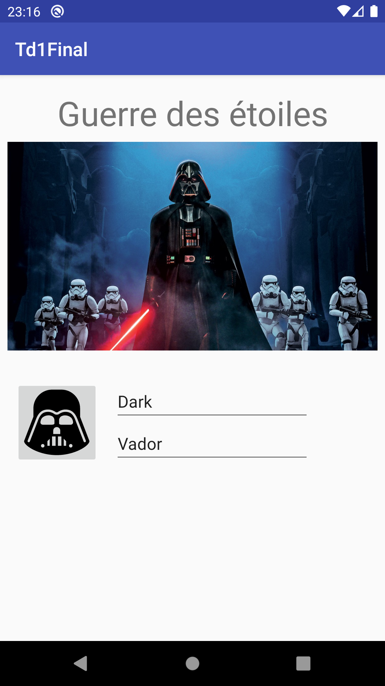

# R4.11 TD 1 : Outils Android - *Layouts* et *Views*

## Objectifs
les objectifs de ce tp sont :

* la prise prise en main d'Android Studio et de ses outils de développement,
* la découverte des différents éléments graphiques et leur disposition.

## Outils Android
 

### Android Studio

L'outil de développement pour créer des applications est `android studio`. Dans un premier temps, il va nous permettre de  découvrir les outils du sdk. 

* Créer une application android avec le `+`

* Choisir `Empty activity`

* Choisir le `Minimum API level` : `API 23 : Android 6.0 (Marshmallow)` et le langage kotlin 

* Attention à laisser le proxy actif via https avec la valeur `srv-proxy-etu-2.iut-nantes.univ-nantes.prive` : 
* si besoin, vous pouvez corriger : `File ⟶ Settings... ⟶ System Settings ⟶ HTTP Proxy` avant de relancer _Sync Project with Gradle Files_

### SDK manager
Le *SDK manager* est l'outil permettant de gérer les plateformes et outils android installés. 
Lancez le via l’icône {} et regardez les éléments présents sur votre machine.

### Device Manager / Emulator
Le _Device Manager_ est l'outil qui permet de gérer les périphériques virtuels à votre disposition. Lancez le via l’icône . Un périphérique, une fois défini, peut être utilisé pour tester une application. Une fois démarré, il est accessible depuis _Emulator_ La documentation de l'émulateur est accessible à l'url suivante : [https://developer.android.com/studio/run/emulator.html](https://developer.android.com/studio/run/emulator.html)

En plus d'utiliser la barre d'outils, il est également possible d'envoyer des commandes à l'émulateur via telnet (sur `localhost`, port `5554`).

 
  

* Définir un nouveau périphérique :
    1. `Select Hardware` pixel 4a par exemple,
    2. `System Image` : *Recommanded* API 33 (au besoin, en faire l'installation) et vérifier que l'émulateur est installé
* Lancer cet émulateur depuis Android Studio.
* Tester le changement d'orientation.
* Mettre le périphérique en français.
* Utiliser chrome. Tester la désactivation du réseau (wifi/cellulaire).
* Télécharger une image
* Activer la localisation, définir des coordonnées GPS (iut joffre par exemple) et afficher la carte correspondante. 
* Envoyer un sms à l'émulateur.
* Simuler un appel.
* Lancer votre première application sur votre émulateur
* ...

## Device File Explorer
* retrouver l'image précédemment téléchargée

## Logcat / Run
Il est possible de suivre l'exécution d'une application (message de log, sorties de votre application, crash d'application)
* ajouter un affichage (`println`) dans la méthode `onCreate`de votre application et retrouver le message dans le panneau _Run_

## Première application

Retour à l'utilisation de l'ide

* Lancer votre première application sur votre émulateur
* Lancer votre première application sur une tablette
* Quel layout est utilisé par défaut ?
* Quel composant est utilisé pour afficher le texte ?
* Modifier ce texte d'abord en dur dans le code du layout, puis dans un autre fichier XML.
* Mettre deux fonds différents avec `android:background` pour le layout et le label.
* Pour le champs de texte, tester les quatre combinaisons possibles pour `android:layout_width` et `android:layout_height` avec les valeur `match_parent` et `wrap_content`
* Remplacer ou compléter le composant (`TextView`) par d'autres (`Button`, ... )
* Utiliser maintenant un "`Plain Text`". 
* Quel est la classe de ce composant ?
* Par quel moyen obtient-on le sous type "`Password (numeric)`" ?

## Layouts

### Constraint
  Reproduire la disposition suivante en utilisant un `ConstraintLayout` ([https://developer.android.com/studio/write/layout-editor.html](https://developer.android.com/studio/write/layout-editor.html)). Indications : 

* le bouton 1 est à 8dp des bords haut et gauche,
* les bas des boutons 2 et 3 sont alignés,
* le bouton 3 est à 32dp sous le bouton 1, 
* le bouton 2 est centré dans l'espace restant à droite du bouton 1,
* la hauteur des boutons 2 et 5 a été fixée à 100dp,
* le bord gauche du bouton 4, les bords droits des boutons 1 et 3 sont alignés
* le bouton 4 est  au quart de l'espace entre bas et bouton 3,
* les lignes de texte des bouton 4 et 5 sont alignés,
* le bouton 5 est à 8dp du bord droit.
    

    

    

### Linear

 Reproduire la disposition suivante en utilisant un `LinearLayout` ( 
    [https://developer.android.com/guide/topics/ui/layout/linear.html](https://developer.android.com/guide/topics/ui/layout/linear.html)). Pour définir un `LinearLayout`, le plus simple est de remplacer le ``ConstraintLayout à l'aide de la fonctionnalité *Convert view...*.

### Grid

Reproduire la disposition suivante en utilisant un `GridLayout` ([https://developer.android.com/reference/android/widget/GridLayout.html](https://developer.android.com/reference/android/widget/GridLayout.html).
 
   
      

## Exercices de synthèse

### Fiche avec photo
 Reproduire la disposition suivante : 

* pour le bouton avec icône, depuis la perspective Android de votre projet, faire un clic droit sur `res` ⟶`New` ⟶ `Vector Asset` ou depuis le `Resource Manager` ⟶ `+` ⟶ `Vector Asset`.

* sélectionner `Local File` et importer le svg. Utiliser cette ressource graphique dans un `ImageButton`.
* pour l'image, copier/coller `photo.jpg` dans les `drawable`s de votre application, puis utiliser un `imageView`.
* faire une version par défaut et une version `fr` où les différents labels sont traduits (`Guerre des étoiles` et 
`Dark Vador`) et la tester (en changeant la langue du dispositif de test).

### Calculatrice

 Reproduire la disposition suivante : 

